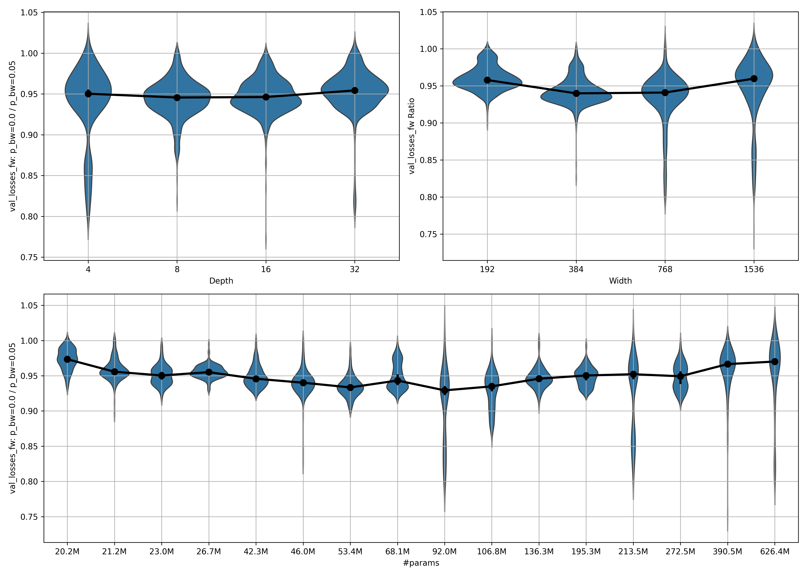
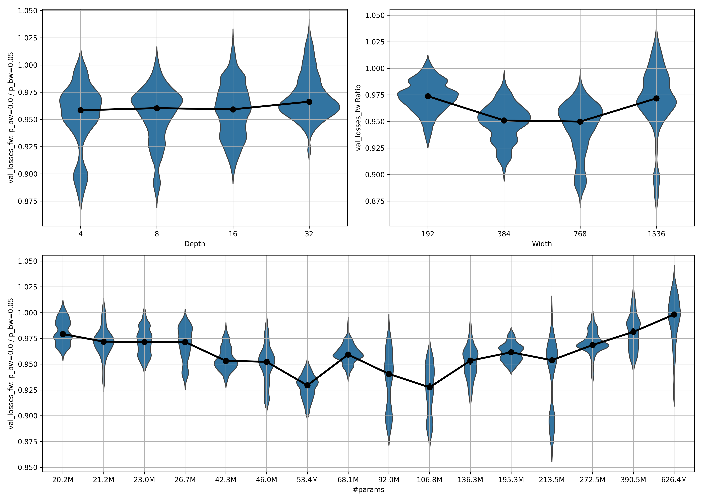
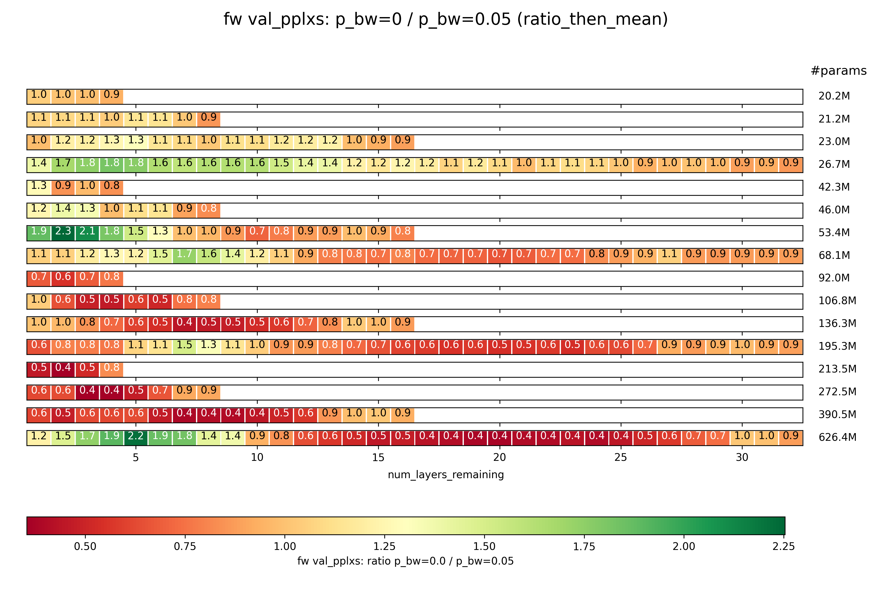
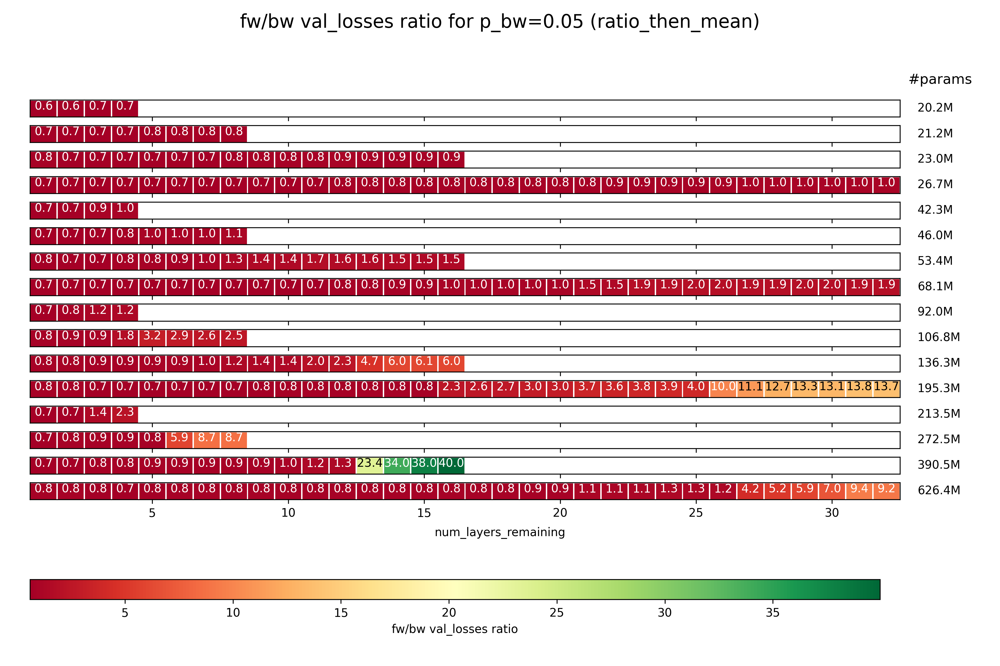
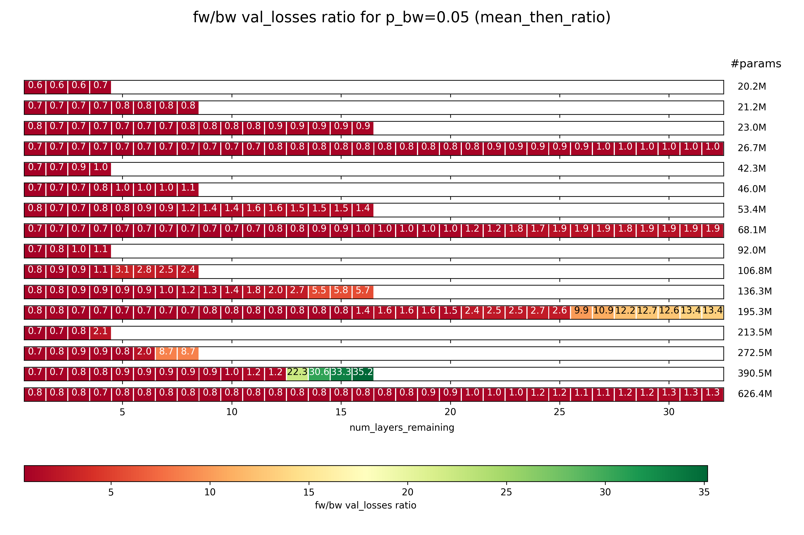

# mask

What if we don't just use a causal mask forward in time (fw), but with a probability $p_{bw}$ a causal mask in the backward direction (bw)?

I can see three potential benefits from this:

1. Forcing the model to learn to distinguish between a fw and bw causal mask, and adjust properly, 
    may serve as a form of **dataset augmentation** that effectively increases the data diversity.
    This is similar to the different pre-training tasks from [Yi Tay et al.'s UL2](https://arxiv.org/abs/2205.05131)
    (it is probably worse, but could be 1. an additional task that makes sense to sprinkle in in small amounts,
    and 2. simpler to apply in finetuning of already pre-trained, causal LLMs).
2. If your limiting factor for computation is **data ingestion** (like I've read it is for Cerebras, for example),
    ingesting the data once, then calculating the loss on both the fw and bw mask could lead to higher 
    utilization of your accelerator. I don't know if this is very relevant, but I wanted to mention it anyway.
3. This could potentially be used to finetune causal LLMs into **BERT-alternatives**.

    Normally, causal language models aren't so great for encoder-only tasks like RAG, because some tokens may
    have relevant references pointing to them in later instead of earlier tokens, which will be ignored at that point.
    For example, a footnote might come after the token in question, but be very important for interpreting it.
    A fully causal model ignores those later tokens; but if we can do a forward pass with the fw task and one with the bw task,
    and then combine the resulting embeddings somehow, we can include the context from all tokens.
    
    Again, UL2 is likely better for this, but training on a bw task can probably be applied in finetuning
    to already-existing, fully causal models.
    So this might enable ColBERT-style late-interaction RAG with extremely high-quality models over potentially
    very long contexts.

I have tested point 1 for now, and the results, while negative at the scales I trained at, show a promising scaling trend.
I suspect that this actually works well!


## Method

I trained hlb-gpt v0.4.1 for 10 epochs on wikitext. I predict using a fw mask and, with probability $p_{bw}$,
also predict using a bw mask on the same tokens (with the labels shifted etc., of course).
I accumulate the losses and then do a backward pass.
Inspired by [Yi Tay et al.'s UL2](https://arxiv.org/abs/2205.05131),
I've informed the models of their task by giving them a special token at the beginning of text
if I'm fw masking or a different one at the end of the text if I'm bw masking.
In early testing, this improved performance noticeably.

I do this for different model sizes:
I trained three models for every combination of depth in $\{4, 8, 16, 32\}$
and width in $\{192, 384, 768, 1536\}$.
This is done for different values of $p_{bw}$: $0\%$, $5\%$ and $10\%$
(in early testing, higher probabilities made the bw prediction too easy).

After a model is trained for 10 epochs, I remove the transformer layers one by one, starting from the back,
and evaluate the resulting model after each removal. I hope that this gives me some insights into
which parts of the model are more important for the fw and bw predictions, respectively. 
My first hypothesis was that early layers are used to distinguish between the fw and bw mask,
and thus the positive effects of dual masking can only occur in deep networks
that can make use of the knowledge extracted in the early layers.

Per setting (depth, width, $p_bw$, or using fw mask only), I train three times.
I've saved all results, but below, will only show you the average over all three runs for each setting.

## Results

Let's quickly work through points 2 and 3:

- Point 2: Fixing data ingestion issues (if they are even a real thing) is unlikely to happen this way.
    $p_{bw} = 10\%$ is already much worse than $p_{bw} = 5\%$, so backward masking at a significant level is undesireable.
- Point 3: Post-training models to serve as late-interaction RAG models may or may not work;
    I haven't tried yet.
    I unfortunately have limited amounts of money and time, as I am doing this privately, so I may never get to trying this out myself.

    However, this should just work; below, you will see that the bw-performance is excellent with $p_{bw} = 5\%$, so I suspect that fine-tuning on this task after the fact would work fine.

With that out of the way, I will now write about point 1, improving performance given a constant number of training tokens.

### Background info

First, a caveat: I always used both a fw- and a bw-mask for the same tokens, whenever I did use a bw-mask.
I think that it's possible that the models would perform better if the fw- and bw-mask were exclusive,
but I went into the experiments with point 2 (data ingestion) in mind and finished those experiments.
I may do those other experiments at some point, if my budget allows it.

Unless specifically stated otherwise, $p_{bw} = 5\%$ for all of them, because with $p_{bw} = 10\%$,
the relative performance between models trained with the fw-mask only and those trained with a bidirectional mask
was very skewed towards the fw-only models.

### Metrics

Besides the obvious metrics, like validation loss or accuracy, I look at two ratios that are very telling:

1. **ratio 1: ($p_{bw} = 0\%$) / ($p_{bw} = x>0\%$); \<metric\> fw**: 
    The models trained with $p_{bw} > 0\%$ are obviously better at the bw prediction
    than the ones trained with $p_{bw} = 0\%$.
    What I'm interested in here is how a non-zero $p_{bw}$ impacts the fw performance of the models.
    This ratio is the performance for $p_{bw} = 0\%$ divided by the performance for $p_{bw} = x\%$,
    where $x$ is usually $5$, and the \<metric\> is usually just the validation loss.
2. **ratio 2: \<metric\> fw / bw; $p_{bw} = x \ge 0 \%$**:
    How much better is a model at the fw task than the bw task?
    Lower obviously means better fw, while higher means better bw performance.
    This will be interesting when looking at performance with layers removed.

For both, I have two ways to calculate the average ratio over several runs:

1. First calculate the means of the metric over the runs, then calculate the ratio.
    This will squash outliers. I will call it `mean_then_ratio`.
2. First calculate the individual ratios per step/..., then average them over the runs.
    This measure is more receptive to outliers. I will call it `ratio_then_mean`.

### Performance for different widths

To get a feel for how training evolves for different $p_{bw}$ at different model scales,
let's first look at the fw and bw validation loss for the default model size in hlb-gpt:


As you can see, the fw loss is lower in the model trained only on the fw task
than for the one trained on both the fw and the bw task, even after $10$ epochs.
As we will see later, this likely changes with scale.

It is also very obvious, however, that even a small $p_{bw}$ of $5\%$ will lead to a very loss bw loss,
while the bw loss actually increases for the models trained with $p_{bw} = 0\%$.
This is a nice validation that something is working as intended,
and the intended benefits for downstream RAG tasks may actually come true.

Now, let's look at how this behaves for different model scales.


### Performance by model scale

Below, I show the ratio 1 between the fw performance of models trained with $p_{bw} = 0\%$ compared to those trained with $p_{bw} = 5\%$ (as described [above under Metrics](#metrics)) for models of different
width and depth, as well as over the combined number of parameters.

I compute the ratio independently for each of the training runs per setting,
and independently for each of $500$ steps over the approximately $10$ epochs
(for details, see the code provided in *plot_results.py*).

Then, take the ratios falling into the range $\left[\mathrm{epoch}_{\mathrm{start}} ... \mathrm{epoch}_{\mathrm{stop}}\right]$
and plot them as a boxplot or violinplot.

Below, you can see the violinplot for all available data ($\mathrm{epoch}_{\mathrm{start}} = 0, \mathrm{epoch}_{\mathrm{stop}} = 10$):


A few thoughts:

- There seems to be an inverse scaling law for small model sizes.
    This has its minimum at $106.8$ million parameters.
- Beyond that, positive scaling laws apply.
    As the number of parameters grows, the ratio increases as well,
    meaning that the models trained with $p_{bw} = 5\%$ are catching up in fw performance
    to the models trained with $p_{bw} = 0\%$.
- In the largest model, performance has caught up.
    This is fantastic! It implies that with the model sizes common today, using $p_{bw} = 5\%$
    at worst doesn't negatively impact fw performance, while unlocking BERT-like capabilities,
    and at best positively impacts fw performance.
- This scaling law&mdash;first inverse, then normal&mdash;applies more strongly to the width than to the depth.

So how does this apply at different epochs during training?
Here is the violinplot of ratio 1 for only the first epoch
($\mathrm{epoch}_{\mathrm{start}} = 0, \mathrm{epoch}_{\mathrm{stop}} = 1$):



It looks like in the first epoch, even the largest model has a ratio significantly below $1$.
This implies that it takes many samples for the models trained with $p_{bw} = 5\%$ to catch up to those
trained with $p_{bw} = 0\%$ in fw performance.
It might be interesting to try this on a more serious dataset than wikitext.

To check out how the performance looks after the models have been trained for a bit, let's look at the ratio for epochs 5 to 10.
This means that the poor performance at early training phases doesn't impact the statistics,
and we get a better idea of what the models will converge to.
Here is ($\mathrm{epoch}_{\mathrm{start}} = 5, \mathrm{epoch}_{\mathrm{stop}} = 10$)




Observations:

- The scaling effects are much stronger here!
- In the largest model, the median ratio is essentially 1.

Taken together, this makes me think that with more scaling, models trained with $p_{bw} = 5\%$ could have the same or even better
fw performance as ones trained with $p_{bw} = 0\%$.

### Performance by model layer

Let's cut away the model's layers one by one and evaluate every time.

#### Ratio 1: $p_{bw} = 0\%$ / $p_{bw} = 5\%$; fw task

How does the relative performance of the models trained with $p_{bw} = 0\%$ vs those trained with $p_{bw} = 5\%$ change
over the layers?

Note that I only compare the performance of the final checkpoint here, so this is much less statistically meaningful than
the analysis above, where I compared performance for many steps throughout training.
However, it gives an indication of the trends in the models per layer and model size.

Because the differences in performance are so low, they are often rounded to $1.0$, which can give a wrong impression.
So instead of the validation loss, I will plot the validation perplexity instead.

Let's begin with `ratio_then_mean`, plotting ratio 1 over the number of layers remaining:



Some intersting things are going on here:

- In the deep models, it seems like the ratio is high in early layers.
    This means that early layers of models trained with $p_{bw} = 5\%$
    are stronger in the fw task than those of ones trained with $p_{bw} = 0\%$.
- In the same deep models, the middle layers are aweful for $p_{bw} = 5\%$ compared to the same layers for $p_{bw} = 0\%$.
- Only in late layers does the ratio recover and approach $1$ again.
- This could imply one of two things (or both at once, of course):
    1. Models trained with $p_{bw} = 0\%$ do a bunch of irrelevant stuff in early layers,
        do the real work in the middle layers, and then only refine somewhat in the late layers.
        Models trained with $p_{bw} = 5\%$ on the other hand show a more constant improvement in performance.
    2. Models trained with $p_{bw} = 5\%$ are forced to do a lot of good work in early layers,
        then take the bw task into consideration in the middle layers, and consolidate in late layers.
        Models trained with $p_{bw} = 0\%$ on the other hand show a more constant improvement in performance.
    
    It might be interesting to merge models trained with $p_{bw} = 0\%$ with ones trained with $p_{bw} = 5\%$.

And here is `mean_then_ratio`:


As you can see, this is identical, which indicates that there are no serious outliers in either the performance of $p_{bw} = 0\%$ runs or of $p_{bw} = 5\%$ runs.

#### Ratio 2: fw / bw task; $p_{bw} = 5\%$

How does the relative performance between the fw and bw task change?
Importantly, this is not a comparison of fw performance for two different values of $p_{bw}$ as before,
but a comparison between fw and bw performance for the same value of $p_{bw} = 5\%$.

Beginning with `ratio_then_mean`:



A few observations:

-  As the number of layers is cut more and more, the performance of the bw task compared to the fw task drops off rapidly.
    This implies to me that the model learns the fw task, and performs that in the early layers,
    and then somehow manages to invert it into the bw task in the later layers.
- This transformation tends to go pretty slowly through most layers, and then suddenly jump.
- 

To be clear, the absolute performance on both the fw and the bw task falls rapidly with every layer that is removed.
However, as a trend, the later layers seem more important for the bw task, and the earlier layers for the fw task.

Now let's look at the same thing, but calculated as `mean_then_ratio`:



The same trend as above holds, but to a less extreme degree. That means that the variance in results is pretty high.

### Future experiments

- Train an even larger model to see if we actually get a positive effect on the fw performance
    from training bidirectionally.
- Instead of the choice being between training on either both the fw and bw task or only the fw task,
    make it a choice between training on just the fw or just the bw task.
- Finetune some open LLM on a dataset with this method,
    then train it to perform as a ColBERT-replacement RAG tool.

I'm not sure if I will actually get to any of those;
I have a lot of other ideas I want to explore, and way to little money to do it all.

## Acknoledgements

As always, mostly based on [Fern](https://github.com/tysam-code)'s [hlb-gpt](https://github.com/tysam-code/hlb-gpt).

```
cff-version: 1.2.0
message: "Citations would be appreciated if you end up using this tool! I currently go by Fern, no last name given."
authors:
  given-names: "Fern"
title: "hlb-gpt"
version: 0.4.0
date-released: 2023-03-05
url: "https://github.com/tysam-code/hlb-gpt"
```
