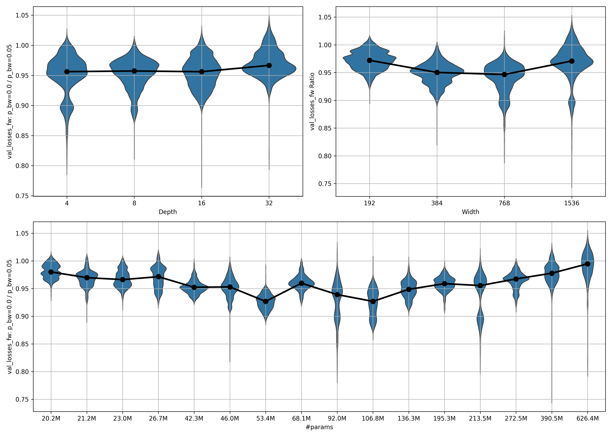

# mask

What if we don't just use a causal mask forward in time (fw), but with a probability $p_{bw}$ a causal mask in the backward direction (bw)?

I can see three potential benefits from this:

1. Forcing the model to learn to distinguish between a fw and bw causal mask, and adjust properly, 
    may serve as a form of dataset augmentation that effectively increases the data diversity
2. If your limiting factor for computation is data ingestion (like I've read it is for Cerebras, for example),
    injesting the data once, then calculating the loss on both the fw and bw mask could lead to higher 
    utilization of your accelerator
3. A ColBERT replacement. That uses BERT-style masking, but the best open models use forward masking.
    I thought it might make sense to enable those powerful models to also do the bw masking necessary to take,
    for example, footnotes into account

All in all, these experiments are mostly a failure, but I'm going to document the results here anyways.


## Method

I trained hlb-gpt v0.4.1 for 10 epochs on wikitext. I predict using a fw mask and, with probability $p_bw$,
also predict using a bw mask on the same tokens (with the labels shifted etc., of course).
I accumulate the losses and then do a backward pass.
Inspired by Yi Tay et al.'s UL2 (todo: get the actual citation, check for misspellings),
I've informed the models of their task by giving them a special token at the beginning of text
if I'm fw masking or a different one at the end of the text if I'm bw masking.

I do this for different model sizes (specifically, I control both the depth and width of the model),
and to values of $p_{bw}$: 0.1 and 0.05 (in early testing, higher probabilities made the bw prediction too easy).

After a model is trained for 10 epochs, I remove the transformer layers one by one, starting from the back,
and evaluate the resulting model after each removal. I hope that this gives me some insights into
which parts of the model are more important for the fw and bw predictions, respectively. 
My first hypothesis was that early layers are used to distinguish between the fw and bw mask,
and thus the positive effects of dual masking can only occur in deep networks
that can make use of the knowledge extracted in the early layers.

Per setting (depth, width, $p_bw$, or using fw mask only), I train three times.
I've saved all results, but below, will only show you the average over all three runs for each setting.

## Results

Let's quickly work through points 2 and 3:

- Point 2: Fixing data ingestion issues (if they are even a real thing) isn't going to happen this way.
    $M_{0.1}$ is already much worse than $M_{0.0}$, so backward masking at a significant level is undesireable.
- Point 3: Post-training models to serve as late-interaction RAG models may or may not work;
    I haven't tried yet (I'm doing this in my freetime with my own money, of which I only have limited amounts).
    Maybe I will try next month, maybe not

With that out of the way, I will now write about point 1, improving performance given a constant number of training tokens.

### Background info

First, a caveat: I always used both a fw- and a bw-mask for the same tokens, whenever I did use a bw-mask.
I think that it's possible that the models would perform better if the fw- and bw-mask were exclusive,
but I went into the experiments with point 2 (data ingestion) in mind and finished those experiments.
I may do those other experiments at some point, if my budget allows it.

Unless specifically stated otherwise, $p_{bw} = 5\%$ for all of them, because with $p_{bw} = 10\%$,
the relative performance between models trained with the fw-mask only and those trained with a bidirectional mask
was very skewed towards the fw-only models.

### Metrics

- **val_loss**: The validation loss in fw- and bw-direction.
- **ratio**: The models trained with $p_{bw} > 0\%$ are obviously better at the bw prediction
    than the ones trained with $p_{bw} = 0\%$.
    What I'm interested in here is how a non-zero $p_{bw}$ impacts the fw performance of the models.
    The *ratio* is the performance for $p_{bw} = 0\%$ divided by the performance for $p_{bw} = x\%$,
    where $x$ is usually $5$, and the performance is usually just measured by the validation loss.

I have captured other metrics as well, such as the accuracy and perplexity, for both training and validation,
but those two are the main ones I will present.

### Performance for different widths

To get a feel for how training evolves for different $p_{bw}$ at different model scales,
let's first look at the fw and bw validation loss for the default model size in hlb-gpt:


As you can see, the fw loss is lower in the model trained only on the fw task
than for the one trained on both the fw and the bw task, even after $10$ epochs.
As we will see later, this likely changes with scale.

It is also very obvious, however, that even a small $p_{bw}$ of $5\%$ will lead to a very loss bw loss,
while the bw loss actually increases for the models trained with $p_{bw} = 0\%$.
This is a nice validation that something is working as intended,
and the intended benefits for downstream RAG tasks may actually come true.

Now, let's look at how this behaves for different model scales.


### Performance by model scale

To gauge the scaling behavior of this technique,
I trained three models for every combination of depth in $\{4, 8, 16, 32\}$
and width in $\{192, 384, 768, 1536\}$.

Below, I show the ratio (as described [above under Metrics](#metrics)) for models of different
width and depth, as well as over the combined number of parameters.

I compute the ratio independently for each of the training runs per setting,
and independently for each of $500$ steps over the approximately $10$ epochs
(for details, see the code provided in *plot_results.py*).

Then, take the ratios falling into the range $\left[\mathrm{epoch}_{\mathrm{start}}, \mathrm{epoch}_{\mathrm{stop}}\right]$
and plot them as a boxplot or violinplot.

Below, you can see the violinplot for all available data ($\mathrm{epoch}_{\mathrm{start}} = 0, \mathrm{epoch}_{\mathrm{stop}} = \mathrm{inf}$):



A few thoughts:

- There seems to be an inverse scaling law for small model sizes.
    This has its minimum at $106.8$ million parameters.
- Beyond that, positive scaling laws apply.
    As the number of parameters grows, the ratio increases as well,
    meaning that the models trained with $p_{bw} = 5\%$ are catching up in fw performance
    to the models trained with $p_{bw} = 0\%$.
- In the largest model, performance has caught up.

**Why the inverse scaling?**

I suspect that the inverser scaling for small models is a result of the specific setup.

...fw & bw or fw only...

This leads to overfitting to and memorization of the tokens that are seen for both the fw and bw task.

How does that lead to the observed scaling behavior?

- The smallest models have so little model capacity that they cannot do much memorization,
    forcing them to generalize a bit.
    This means that training on the bw task doesn't decay performance on the fw task too much.
- At a middle size, memorization takes over, leading to poor generalization compared to what the model capacity allows.
- At a large size, the model is strong enough to memorize all the data, regardless of the training task and how often it was seen.
    It then generalizes beyond that (maybe by interpolation, doesn't matter for this argument).

...making choice might be better...


### Future experiments

- Train an even larger model to see if we actually get a positive effect on the fw performance
    from training bidirectionally.
- Instead of the choice being between training on either both the fw and bw task or only the fw task,
    make it a choice between training on just the fw or just the bw task.
- Finetune some open LLM (phi3 or whatever) on a dataset with this method,
    then train it to perform as a ColBERT-replacement RAG tool.

I'm not sure if I will actually get to any of those;
I have a lot of other ideas I want to explore, and way to little money to do it all.


## Acknoledgements

As always, mostly based on [Fern](https://github.com/tysam-code)'s [hlb-gpt](https://github.com/tysam-code/hlb-gpt).

```
cff-version: 1.2.0
message: "Citations would be appreciated if you end up using this tool! I currently go by Fern, no last name given."
authors:
  given-names: "Fern"
title: "hlb-gpt"
version: 0.4.0
date-released: 2023-03-05
url: "https://github.com/tysam-code/hlb-gpt"
```
